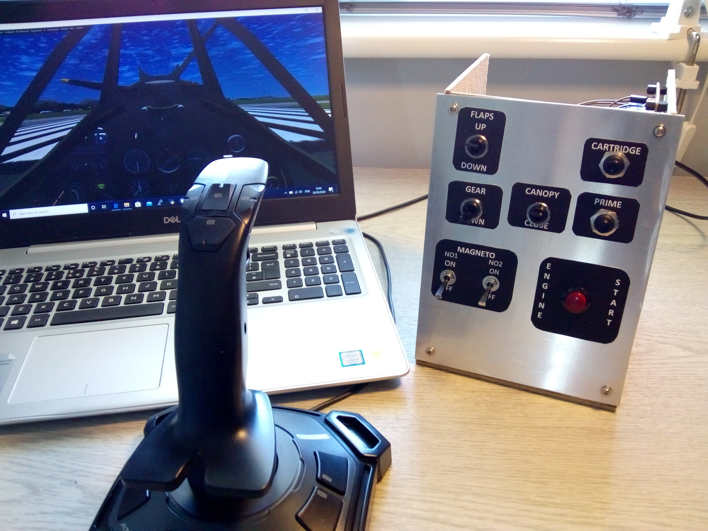
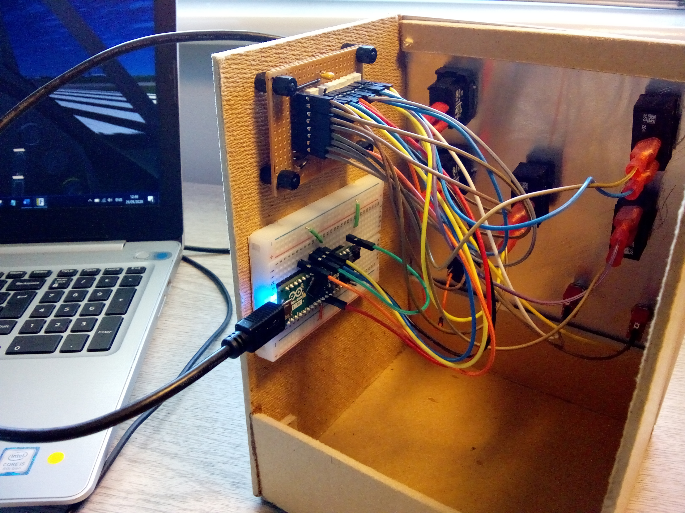
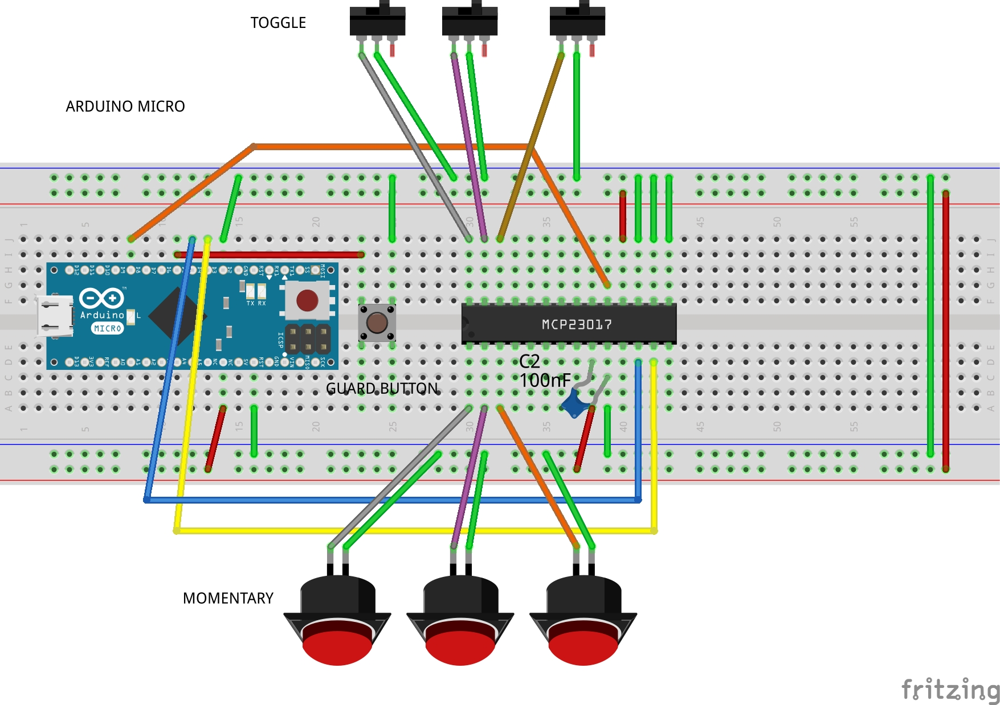

# Spitfire Flightgear Controller
Arduino Micro keyboard emulator for Flightgear Spitfire IIa

# Introduction
The Arduino Micro can emulate a keyboard and be programmed to send keyboard characters to games etc. Not all Arduino's can do this! 

A Microchip [MCP23017](https://ww1.microchip.com/downloads/en/devicedoc/20001952c.pdf) IO expansion module is used to extend the number of IO's available with interrupts for use with a switch panel.

The code was adapted from examples by [Nick Gammon](https://www.gammon.com.au/forum/?id=10945) for use with the lovely [Flightgear Spitfire IIa](https://wiki.flightgear.org/Supermarine_Spitfire) by Vivian Meazza.

# Switch Panel
I used several different types of switches for some of the main Spitfire controls in the sim, mounted in a hardboard box with an aluminium sheet fascia. The labels are laser printed and the layout is meant to look a bit retro.

Panel front view. 

Panel rear view. 
 
# Circuit
Each switch is connected between the IO expander and GND according to this circuit: 

The button mapping is defined in the char constants at the top of the code.

A Run push button is connected between Pin D2 and GND on the Arduino which stops the code from running until it's pressed. Once the Micro is in keyboard mode it is difficult to flash it so this avoids coding accidents.  

# Installation
- Copy or clone the Arduino code
- Flash it to your Micro from the Arduino IDE
- Connect the Micro to your PC with a micro-USB cable
- Press the Run button
- Open a terminal and test that the correct codes are being sent when the switches are activated
- Run Flightgear and load the Spitfire IIa
- Safe flying!

